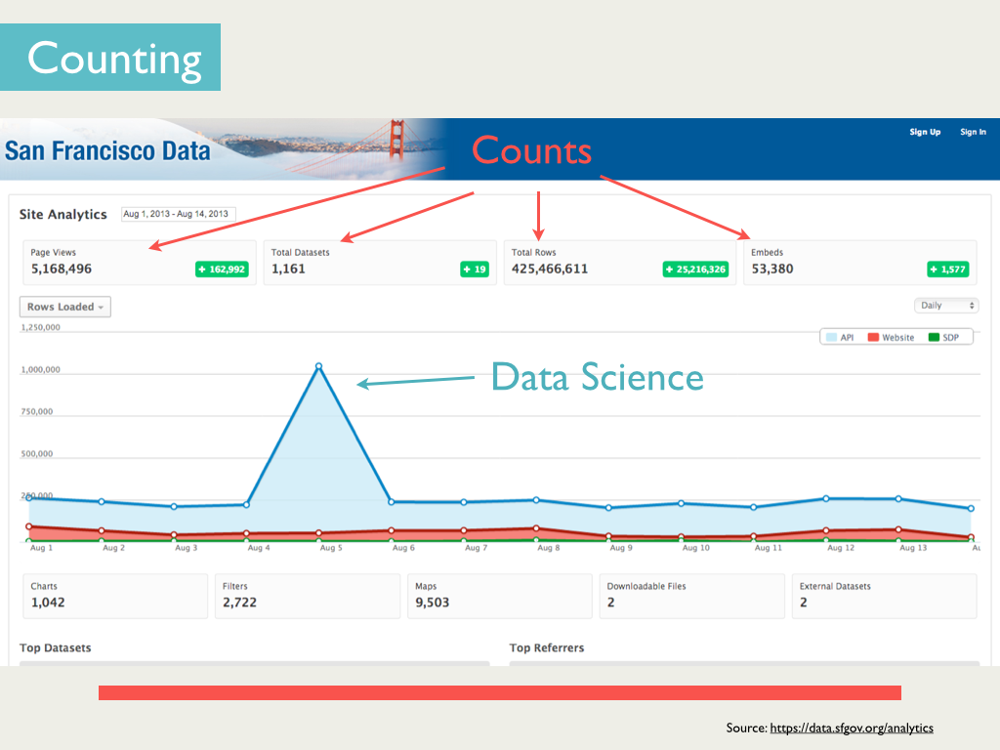
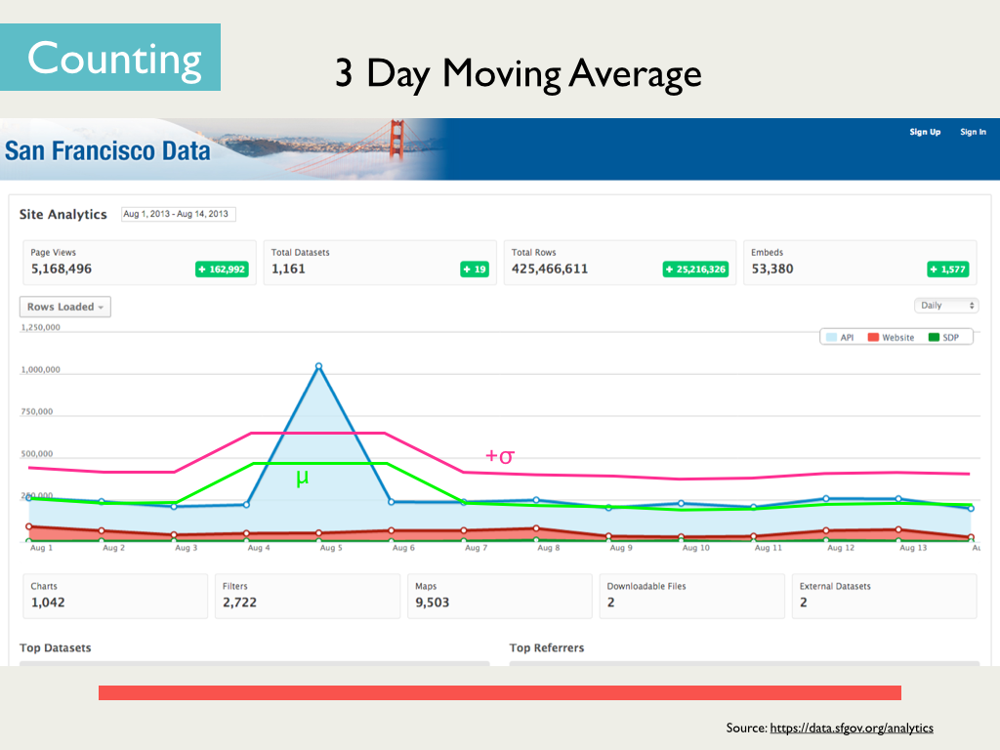
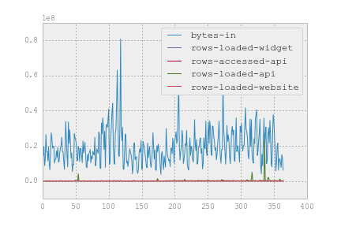
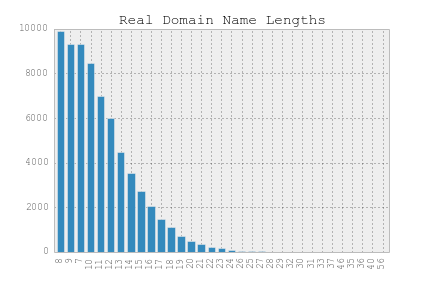
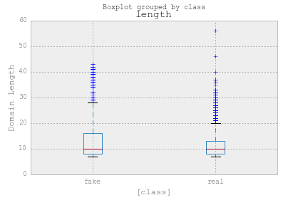
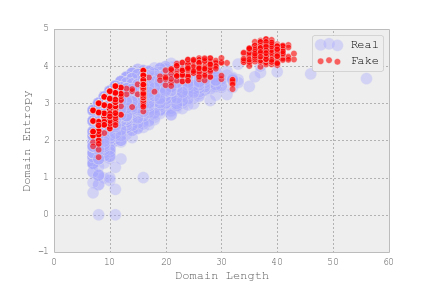
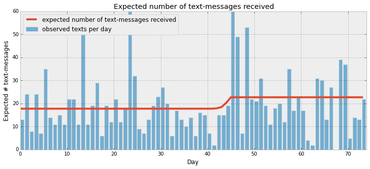

For today's jog we will be exploring a few techniques to detect outliers and anomalous data points.  The sprint will be broken up into two parts, static anomaly detection and temporal anomaly detection.

## Anomalies in Time

A typical application of outlier/anomaly detection is finding unusual patterns in time series data.  A given data point may not seem out of place given the aggregate data, but in context it can be very out of place.

We will be looking at web page requests for [NASA Kennedy Space Center WWW server](http://ita.ee.lbl.gov/html/contrib/NASA-HTTP.html) in Florida for this part.  The data is in `data/nasa_log_july.tsv`

1. Load the data into a DataFrame (and be sure to convert the timestamp on import) and perform some exploration.  What does each column represent?  How many data points are there and what is the time span for the data?

2. Create a Series of the number of visits (across all requests/pages) per minute.

### Moving Window Statistics

2. Look at the trend of visits for across the site.  Plot the timeseries you just created.

3. The simplest approach for time series anomaly detection is simply looking at moving window statistics.  Plot the 3, 5, and 10-day moving averages on your timeseries plot.
    * Can you simply eyeball a good heuristic to detect the peaks/anomolies?

4.  We will look at a given point's delta from the mean (an approximation of a pointwise hypothesis test for outliers).  Plot both 2 and 3 standard deviations from the moving average.

5. How many data points will be considered anomalous if we used 2 standard deviations away from the mean?  How about 3 standard deviations?  What is the probablity of a point existing 3 standard deviations away from the mean (assuming normality)?

### Distributions

We can also try a slightly more sophisticated approach when we know the type of data generating process (people).  We will look at page views for this part of the exercise (since API access is most likely programmatic and may not be governed by a distribution)

2. Are there any interesting patterns you can ascertain in the page views dataset?  Plot a few moving averages (with varying window lengths) on the plot.

3. There may be some interesting patterns, try to find what might be the cause of some of these patterns.  Look at a few of the other columns (think what might relate to page views) and try to find a correlated spike.
    * Try to find out what happened on that day

4. If you had to model this page view data, what distribution would you use (hint: it is one we have covered, we have count data, and it is an aggregate value)?

5. Assuming this distribution at least somewhat approximates the process, use the method of moments (or MLE) to find the ideal parameter(s) for the distribution.

6. According to this distribution, what is average number of visitors expected per day?

7. We can now use this probability to flag any traffic that seems very unlikely.  Using this distribution, flag any data point that has less than a 2.3% chance of happening?
    * How many points are flagged?
    * How many points would be flagged if we used a threshold of 0.1%
    
8. Can you determine which are the weekend days based on the traffic?

### Extra

Perform the same analysis but this time for traffic stats from [sfdata.gov](https://data.sfgov.org/) for this part.  The data is in `data/access.csv`.

__NOTE: Look at what each column trend looks like.  Since there are quite a few columns you probably want to plot 4-5 at a time.__

We will be focusing on the 'rows-loaded-api' column to try to detect any anomalous use of sfdata.gov's [Socrata](http://www.socrata.com/) API [portal](https://data.sfgov.org/analytics).  

1. Perform the above analysis on the 'rows-loaded-api' column.

## Phony Domains (static analysis)

A common problem in website security is the prevalence of fake domains.  These are often algorithmically generated domains used by Botnets in a technique called "domain fluxing".  Basically each botnet has regestered one (or a few) fake domains.  Each individual bot generates tens of thousands algorithmically domains and ping's them until one responds.  This is the bot 'phoning home'.  This allows the bot to change its domain making it very hard to blacklist by security programs.

We will be using supervised and static methods to detect these domain names. Our ground truth will be real domain names from [Alexa](http://www.alexa.com/), located in `data/alexa.csv`.

### Preparation

Let us start simple with some exploratory analysis.  We only care about the top level domain in this case and we also need to create our training dataset.

1. Strip out the TLD (facebook, google, zipfianacademy, etc.) of the url list (no `.com` or `www.` or subdomains)

2. Drop duplicates and NAs in case we have duplicated top level domains.

3. Add a column for the label.  Label these Alexa domains as 0 (to indicate they are clean)

4. Now we need our fake domains.  Load in `data/spoofs.csv` into a dataframe as create a label column with value 1.

5. Concatenate these two datasets together to make our dataset.

### Features

Domain names that are labeled is not enough unfortunately to detect fake names (since all we have is the name).

1. Add a count column to our dataset that represents the length of each domain.  This will help us in distinguishing fake from real names.

2. Hopefully you remember [entropy](http://en.wikipedia.org/wiki/Entropy_(information_theory)) from our decision tree sprint.  Write a function to calculate the entropy of each name.  Example code can be found on [Rosetta Code](http://rosettacode.org/wiki/Entropy#Python:_More_succinct_version).

3. Calculate the entropy of each domain name and add this as a column (use the relative frequency of each character to calculate the entropy).

### Visual metrics

While anomaly detection can be automated and sophisticated, it also can be accomplished by some simple exploratory analysis.

1. Make a histogram of the length of each domain name for each class ('fake' or 'real'). Are there any striking differences between fake and real domain name lengths?  Will this help us distinguish between them?

2. Another way to visualize distributions is with boxplots.  Create a side by side boxplot of the lengths of each class.

3. Do this for the entropy as well and compare.

4.  A single feature alone may not be enough however.  Make a scatterplot of entropy vs. length.

### Supervised

Now that we have some properly featurized data we can apply the typical supervised learning pipeline. Since our feature space is potentially non-linear and complicated, we will try to fit a random forest to our data.

1. Using scikit-learn's RandomForest, fit the feature matrix.  You will want to create a test/train split or perform cross validation.

2. How well does the model score on accuracy?

4. One issue with anomaly detection is that anomalies are... well, anomalous. How many of each class are there?

3.  As we know all too well, accuracy is a very misleading metric (especially with unbalanced classes).  Create confusion matrix to compare the false positives and false negatives.
    * Which is worse in this case (false positive or false negative)?
   
4. To improve on the prediction and detect more of the fake domains we will perform some more feature engineering.  Using scikit-learn compute (and count) 3, 4, and 5 character ngrams of the domain names.

4. Random forest also has the added benefit of performing some feature selection for us.  Since we only have a small number of features this isn't too important from a selection/reduction perspective, but it can tell us a stringer signal for a spoofed domain.  Which feature is the best indicator of a fake domain?

4. We always usually want a second opinion in life.  Use scikit-learn's Logistic regression and create ROC plots for the LogisticRegression and Random forest.  Which one performs better?  And what might we want to set as our threshold?

5. A final supervised technique we will cover is a one class SVM.  You basically fit an SVM to only the inliers.  Using scikit-learn, fit a [one-class SVM](http://scikit-learn.org/stable/auto_examples/svm/plot_oneclass.html#example-svm-plot-oneclass-py) to only the real domain names.

6. How well does a one-class SVM perform on the anomalous domains?  In a hold-out set, test performance on a mix of real and fake domains.  How well does it detect the fake domains?

## Unsupervised

A supervised approach can perform very well (and is often the approach you want to go with given that you have labeled data).  In many cases you do not have labeled data however.  We will now explore a few techniques that apply to the case of unlabeled data.

### Clustering

There are two clustering algorithms that we have not covered but are very naturally suited for [unsupervised anomaly detection](http://www2009.eprints.org/151/1/p1141.pdf): Affinity Propagation and DBSCAN.

For this section we will focus on DBSCAN and assume we do not have appropriate labels on our data.

1. Using scikit learn's [DBSCAN](http://scikit-learn.org/stable/modules/clustering.html#dbscan), cluster domains based on entropy and length.

2. Color the true and fake domains separately and visually inspect the resulting clusters.

3. With DBSCAN you do not have to specify a number of clusters, but it has two parameters to tune.  Play with the `eps` and `min_samples` parameters to find the two that maximize the number of outliers detected.  You can do this visually and select a best guess or you can try to do it programmatically.

## Extra -- Bayesian

In [Probabilistic Programming and Bayesian Methods for Hackers](http://nbviewer.ipython.org/github/CamDavidsonPilon/Probabilistic-Programming-and-Bayesian-Methods-for-Hackers/blob/master/Chapter1_Introduction/Chapter1_Introduction.ipynb), the author applies bayesian reasoning to try to detect a change in his text message usage.  We can apply a similar technique to the sfdata.gov website statistics.

1. Using PyMC, fit two distributions to the data with a variable lambda 1 and lambda 2 parameter (and a threshold tau).

2. What is the most likely value for the boundary between the two distributions (tau).

3. Also plot the expected number of visits to the webpage for each of the learned distributions

